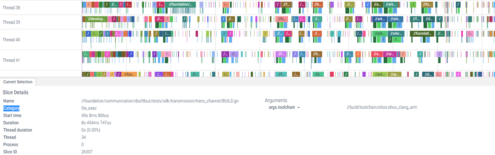
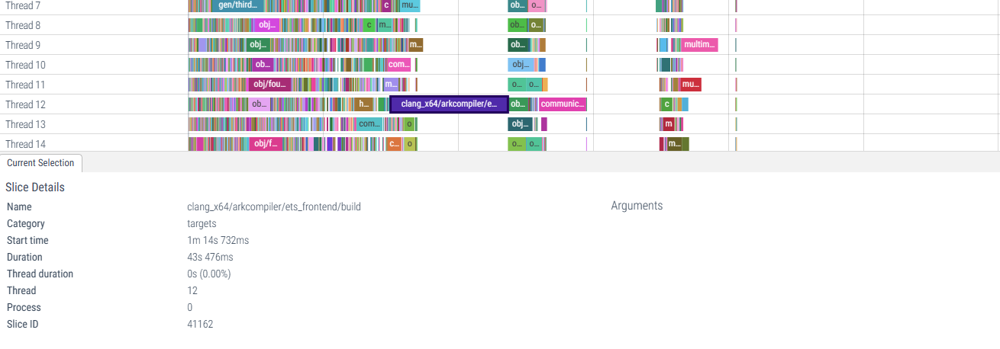
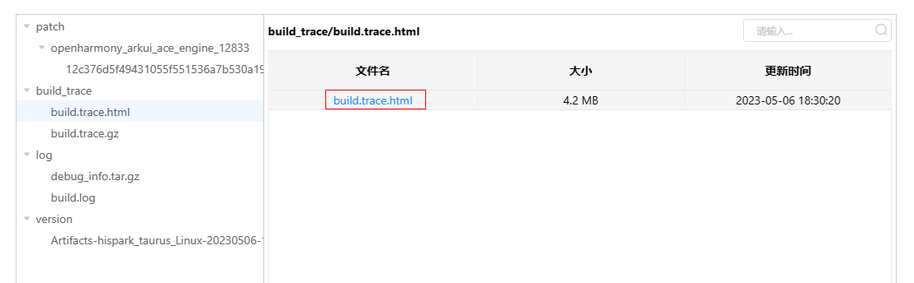

# 编译性能分析常用工具

## gn阶段性能分析

### 使用gn time功能分析gn解析阶段性能

编译命令：./build.sh --product-name rk3568 --ccache --gn-flags="--time"
编译结束之后gn会输出以下内容，我们通过观察耗时较长的部分来针对性优化.

~~~
File parse times: (time in ms, name)
    650.18  //foundation/bundlemanager/bundle_framework/services/bundlemgr/test/unittest/bms_bundle_installer_test/BUILD.gn
    293.70  //third_party/flutter/build/skia/BUILD.gn
    ......

File execute times: (total time in ms, # executions, name)
    121479.80  1  //base/startup/init/test/fuzztest/BUILD.gn
    96465.00  1  //foundation/distributeddatamgr/kv_store/frameworks/libs/distributeddb/test/BUILD.gn
    ......

Script execute times: (total time in ms, # executions, name)
    2007690.21  5694  //build/templates/common/external_deps_handler.py
    1957474.75  4860  //build/ohos/testfwk/gen_module_list_files.py
    ......
~~~

### 使用gn trace功能分析gn解析阶段性能

编译命令：./build.sh --product-name rk3568 --ccache --gn-flags="--tracelog=gn.trace"
可以将gn.trace拖动到"https://www.ui.perfetto.dev/" 来查看gn解析阶段各部分耗时以及并行度.

## ninja阶段性能分析

### 本地
ninja执行过后会在对应输出目录（如out/rk3568）生成build.trace.gz文件，将其解压然后将build.trace拖动到"https://www.ui.perfetto.dev/" 来查看ninja解析阶段各部分耗时以及并行度.

此外也会生成sorted_action_duration.txt，其按照降序排列每个目标的耗时.

~~~
../kernel/src_tmp/linux-5.10/boot_linux: 431628
arkcompiler/ets_runtime/libark_jsruntime.so: 141654
......
~~~

### 门禁
目前Openharmony ci已经默认把ninja trace转换成可直接读取的html，具体位置为：
