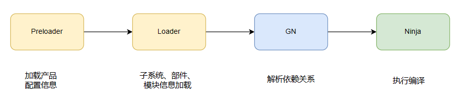
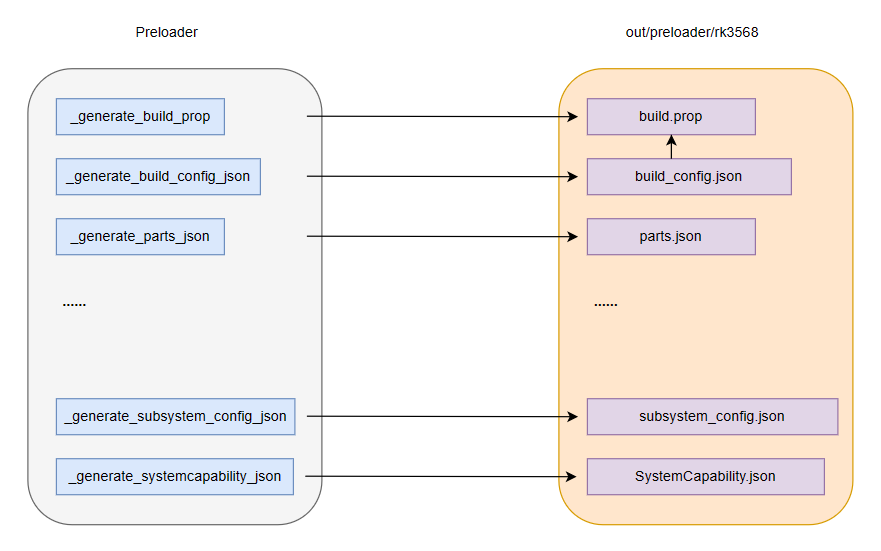
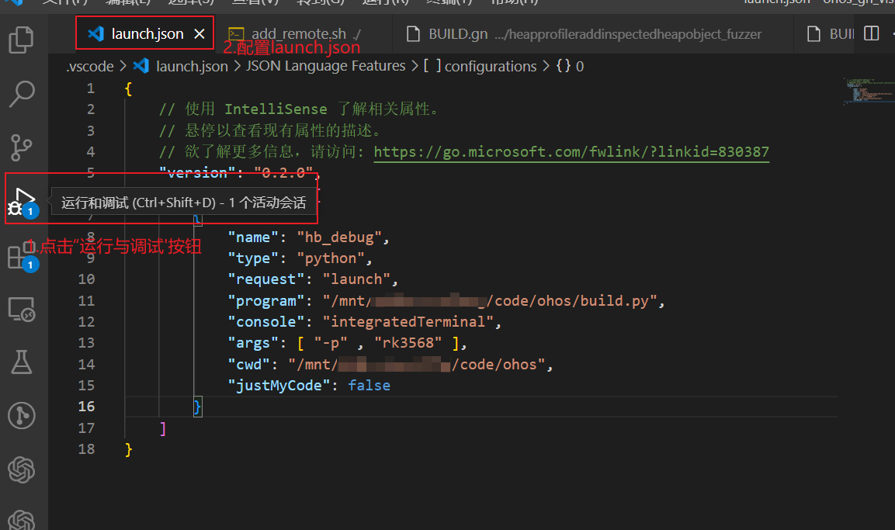
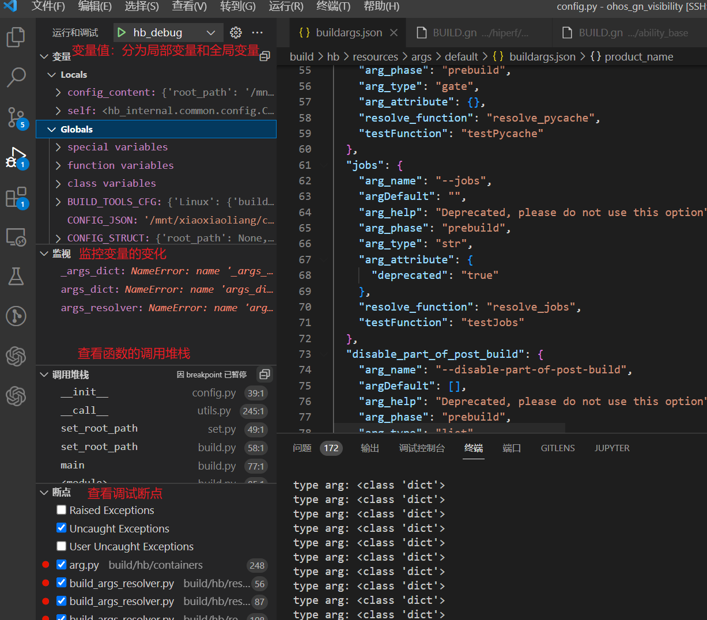
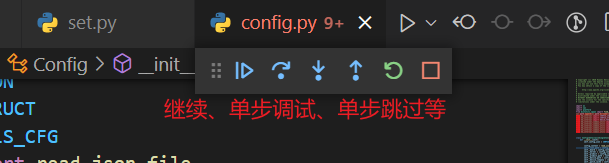

# 编译构建调试指导

## Vs Code插件配置

建议初学者配置Vs Code并安装插件实现高效Openharmony项目的高效开发。以下列出了常用的插件列表以及功能，开发者可以按需进行配置和使用。

| 插件               | 作用                                                  |
| ------------------ | ----------------------------------------------------- |
| Remote-SSH         | 连接远程服务器                                        |
| GN                 | GN语法高亮                                            |
| GN format          | GN格式化工具，实现右键格式化GN文件                    |
| GN Language Server | GN关键字说明、提示、补全、跳转                        |
| python             | Python语法高亮，debug                                 |
| Pylance            | Python代码补全，API说明                               |
| gitlens            | 增强Git功能，可视化本地分支、远程分支以及历史提交信息 |
| clangd             | LLVM官方插件，实现代码跳转，自动补全，语义检查等功能  |

插件Remote-SSH示例：


### Preloader、Loader阶段调试

#### 1.背景介绍

建议开发者在阅读本教程前先查看[编译构建指导文档](https://gitee.com/openharmony/docs/blob/master/zh-cn/device-dev/subsystems/subsys-build-all.md)，对整个Openharmony的产品、子系统、部件、模块以及构建系统GN和Ninja等概念有基本了解。接下来介绍整个Openahrmony的编译流程和各阶段的调试定位方法。

Openharmony完整的编译构建流程主要可以分成以下四个阶段：Preloader、Loader、GN以及Ninja过程。



​	Preloader和Loader阶段主要是执行python脚本preloader.py和loader.py，Preloader阶段根据vendor仓的产品配置config.json文件对产品配置进行解析，并将解析结果输出到out/preloader/{product_name}目录下，loader阶段进行部件化配置的加载，并将解析结果输出到out/{product_name}/build_configs文件夹下。以下主要介绍preloader和loader阶段的调试过程，帮助开发者更好的调试Openharmony代码，定位preloader和loader阶段的错误，提升开发效率。



#### 2. preloader阶段调试

- 配置launch.json

点击Vs Code左侧”运行与调试按钮“，配置launch.json内容



```
{
    // 使用 IntelliSense 了解相关属性。 
    // 悬停以查看现有属性的描述。
    // 欲了解更多信息，请访问: https://go.microsoft.com/fwlink/?linkid=830387
    "version": "0.2.0",
    "configurations": [
        {
            "name": "hb_debug",
            "type": "python",
            "request": "launch",
            "program": "/mnt/xiaoxiaoliang/code/ohos/build.py",
            "console": "integratedTerminal",
            "args": [ "-p" , "rk3568" ],
            "cwd": "/mnt/xiaoxiaoliang/code/ohos",
            "justMyCode": false
        }
    ]
}
```

各字段含义：

| 字段       | 含义                                                         |
| ---------- | ------------------------------------------------------------ |
| name       | 调试器名称，随便取一个就可以                                 |
| type       | 必填项，调试类型，选择相应语言类型                           |
| request    | 必填项，有两种类型，分别是 `launch` 和 `attach`，这里选launch即可 |
| program    | 需要调试的脚本路径                                           |
| console    | integratedTerminal、internalConsole、externalTerminal，这里选择integratedTerminal即可 |
| args       | 传递给脚本的参数                                             |
| cwd        | 脚本所在路径                                                 |
| justMyCode | true或false，设置为true，只调试用户自己编写的代码，false则会调试标准库的代码 |

- 开始调试，设置断点，然后点击hb_debug按钮进行调试



| 字段     | 含义                             |
| -------- | -------------------------------- |
| 变量     | 查看变量的值，监控变量的变化情况 |
| 监视     | 选择自己想要监控的变量           |
| 调用堆栈 | 查看函数的调用堆栈               |
| 断点     | 查看所有设置的断点信息           |

- 单步调试等



- 调试preloader、loader过程

建议开发者基于以上方法对preloader和loader进行调试，从而查看产物与函数之间的一一对应关系，当编译出错时，分清楚出错阶段，进行对阶段的产物进行横向对比分析，找到问题根源

## GN调试

以下列表列出了常见的GN调试命令供开发者查阅和使用，主要介绍了命令以及它的详细使用方法。

| 命令           | 作用                                                         | 详细命令                                                     |
| -------------- | ------------------------------------------------------------ | ------------------------------------------------------------ |
| gn gen         | 产生ninja文件                                                | gn gen [--check] [<ide options>] <out_dir>                   |
| gn ls          | 列出目录下所有的target                                       | gn ls <out_dir> [<label_pattern>] [--default-toolchain] [--as=...] |
| gn args        | 列出所有的gn参数                                             | gn args <out_dir> [--list] [--short] [--args] [--overrides-only] |
| gn desc        | 列出target/config的所有信息                                  | gn desc <out_dir> <label or pattern> [<what to show>] [--blame]           [--format=json] |
| gn path        | 查看两个target之间的依赖路径                                 | gn path <out_dir> <target_one> <target_two>                  |
| gn refs        | 查看依赖关系                                                 | gn refs <out_dir> (<label_pattern>\|<label>\|<file>\|@<response_file>)* [--all]           [--default-toolchain] [--as=...] [--testonly=...] [--type=...] |
| gn check       | 检查头文件的依赖是否正确                                     | gn check <out_dir> [<label_pattern>] [--force] [--check-generated] |
| gn analyze     | 分析哪些目标受到文件列表的影响                               | gn analyze <out_dir> <input_path> <output_path>              |
| gn meta        | 列出target的metadata的收集结果                               | gn meta <out_dir> <target>* --data=<key>[,<key>*]* [--walk=<key>[,<key>*]*]           [--rebase=<dest dir>] |
| gn help        | 查看帮助文档                                                 | gn help <anything>                                           |
| gn format      | 格式化gn文件                                                 | gn format [--dump-tree] (--stdin \| <list of build_files...>) |
| gn clean       | 删除输出目录中除args.gn之外的内容                            | gn clean <out_dir>...                                        |
| gn clean_stale | 从生成目录中删除不再需要的输出文件，同时删除它们的ninja构建记录 | gn clean_stale [--ninja-executable=...] <out_dir>...         |

#### Thirdparty/gn调试过程

建议初学者以Openharmony三方库的gn仓为例进行学习，首先进入third_party/gn/examples/simple_build文件夹，该文件描述了一个最基本的C++文件的编译配置，如下可执行程序hello依赖了动态库文件hello_shared以及静态库hello_static。

```
# Copyright 2014 The Chromium Authors. All rights reserved.
# Use of this source code is governed by a BSD-style license that can be
# found in the LICENSE file.
executable("hello") {
  sources = [ "hello.cc" ]
  deps = [
    ":hello_shared",
    ":hello_static",
  ]
}
shared_library("hello_shared") {
  sources = [
    "hello_shared.cc",
    "hello_shared.h",
  ]

  defines = [ "HELLO_SHARED_IMPLEMENTATION" ]
}
static_library("hello_static") {
  sources = [
    "hello_static.cc",
    "hello_static.h",
  ]
}
```

在目录下执行gn gen -C out同时进入out文件夹下，分别执行以下命令。

- gn ls out

  ```
  //:hello
  //:hello_shared
  //:hello_static
  ```

  该命令列出了gn编译过程中的所有target列表，可以看出，包含一个可执行程序//:hello、一个动态库//:hello_shared和一个静态库//:hello_static。

- gn refs out //:hello_shared

  ```
  //:hello
  ```

​       gn refs列出了哪些目标依赖了目标//:hello_shared，从上面可以看出目标//:hello依赖了目标//:hello_shared，从GN配置文件也可以看出来。

- gn desc out //:hello_shared

  ```
  Target //:hello_shared
  type: shared_library
  toolchain: //build/toolchain:gcc
  
  visibility
    *
  
  metadata
    {
  
    }
  
  testonly
    false
  
  check_includes
    true
  
  allow_circular_includes_from
  
  sources
    //hello_shared.cc
    //hello_shared.h
  
  public
    [All headers listed in the sources are public.]
  
  configs (in order applying, try also --tree)
    //build:compiler_defaults
  
  outputs
    //out/libhello_shared.so
  
  cflags
    -fPIC
    -pthread
  
  defines
    HELLO_SHARED_IMPLEMENTATION
  
  Direct dependencies (try also "--all", "--tree", or even "--all --tree")
  
  externs
  ```

  gn desc查看目标//:hello_shared的所有信息，这个命令非常实用，记录了目标的visibility、metadata、cflags、defines等重要信息，建议开发者多使用该功能进行调试。

- gn path out //:hello //:hello_shared

  ```
  //:hello --[private]-->
  //:hello_shared
  
  1 non-data path found. It is not public.
  ```

  查看两个目标之间的依赖路径。从上面我们可以看出，//:hello和//:hello_shared是私有依赖的关系，且两者是直接依赖的。

- gn args --list out

  ```
  current_cpu
      Current value (from the default) = ""
        (Internally set; try `gn help current_cpu`.)
  
  current_os
      Current value (from the default) = ""
        (Internally set; try `gn help current_os`.)
  
  host_cpu
      Current value (from the default) = "x64"
        (Internally set; try `gn help host_cpu`.)
  
  host_os
      Current value (from the default) = "linux"
        (Internally set; try `gn help host_os`.)
  
  target_cpu
      Current value (from the default) = ""
        (Internally set; try `gn help target_cpu`.)
  
  target_os
      Current value (from the default) = ""
        (Internally set; try `gn help target_os`.)
  ```

  查看编译过程中的gn参数列表。

- gn check out

  ```
  Header dependency check OK
  ```
  
  查看编译过程中的头文件依赖是否正确。
  
- gn format `find . -name "*.gni" -o -name "*.gn"`

  上述命令可以格式化当前文件夹下的所有GN文件，包括.gni文件和.gn文件。
  
#### Openharmony调试过程

以编译rk3568为例，执行编译命令./build.sh --product-name rk3568并进入out/rk3568文件夹。

- gn desc out/rk3568 //build/rust/tests/test_dylib_crate:test_dylib_crate

  ```
  Target //build/rust/tests/test_dylib_crate:test_dylib_crate
  type: executable
  toolchain: //build/toolchain/ohos:ohos_clang_arm
  
  crate_name
    test_dylib_crate
  
  crate_root
    //build/rust/tests/test_dylib_crate/src/main.rs
  
  visibility
    *
  
  metadata
    {
      install_modules = [
        {
          module_def = "//build/rust/tests/test_dylib_crate:test_dylib_crate(//build/toolchain/ohos:ohos_clang_arm)",
          module_info_file = "obj/build/rust/tests/test_dylib_crate/test_dylib_crate_module_info.json",
          part_name = "common",
          subsystem_name = "common",
          toolchain = "//build/toolchain/ohos:ohos_clang_arm",
          toolchain_out_dir = "."
        }
      ]
    }
  
  testonly
    false
  
  check_includes
    true
  
  allow_circular_includes_from
  
  sources
    //build/rust/tests/test_dylib_crate/src/main.rs
  
  public
    [All headers listed in the sources are public.]
  
  configs (in order applying, try also --tree)
    //build/config:feature_flags
    //build/config/compiler:afdo
    ......
    //build/rust:libstd.dylib.so__config
    //build/rust:libtest.dylib.so__config
  
  public_configs (in order applying, try also --tree)
    //build/rust:libstd.dylib.so__config
  
  outputs
    //out/rk3568/exe.unstripped/common/common/test_dylib_crate
    //out/rk3568/common/common/test_dylib_crate
  
  arflags
    -T
  
  asmflags
    -fno-strict-aliasing
    --param=ssp-buffer-size=4
    ......
    -g2
    --sysroot=obj/third_party/musl
    -fno-common
    -fPIE
  
  cflags
    -fno-strict-aliasing
    --param=ssp-buffer-size=4
    ......
    -Wtautological-overlap-compare
    -fPIE
    -ftrivial-auto-var-init=zero
    -enable-trivial-auto-var-init-zero-knowing-it-will-be-removed-from-clang
  
  cflags_c
    --sysroot=obj/third_party/musl
  
  cflags_cc
    -std=c++17
    -fno-exceptions
    -fno-rtti
    --sysroot=obj/third_party/musl
    -fvisibility-inlines-hidden
  
  cflags_objc
    --sysroot=obj/third_party/musl
  
  cflags_objcc
    -std=c++17
    -fno-exceptions
    -fno-rtti
    --sysroot=obj/third_party/musl
  
  defines
    V8_DEPRECATION_WARNINGS
    _GNU_SOURCE
    HAVE_SYS_UIO_H
    ......
    NDEBUG
    NVALGRIND
    DYNAMIC_ANNOTATIONS_ENABLED=0
  
  include_dirs
    //out/rk3568/obj/third_party/musl/usr/include/arm-linux-ohos/
    //out/rk3568/override/third_party/
    //
    //out/rk3568/gen/
  
  ldflags
    -Wl,--pack-dyn-relocs=android+relr
    -Wl,--fatal-warnings
    -Wl,--build-id=md5
    -fPIC
    -Wl,-z,noexecstack
    ......
    -Wl,--gdb-index
    --sysroot=obj/third_party/musl
    -nostdlib
    -Lobj/third_party/musl/usr/lib/arm-linux-ohos
    -L../../prebuilts/clang/ohos/linux-x86_64/llvm/lib/clang/15.0.4/lib/arm-linux-ohos
    -Wl,--warn-shared-textrel
    -Bdynamic
    -Wl,-z,nocopyreloc
    -pie
  
  Direct dependencies (try also "--all", "--tree", or even "--all --tree")
    //build/config:executable_deps
    ......
    //build/rust/tests/test_dylib_crate:test_dylib_crate_info
  
  libs
    unwind
    //prebuilts/clang/ohos/linux-x86_64/llvm/lib/clang/15.0.4/lib/arm-linux-ohos/libclang_rt.builtins.a
    c++
    c
    //prebuilts/clang/ohos/linux-x86_64/llvm/lib/arm-linux-ohos/libc++abi.a
    dl
    m
    //out/rk3568/obj/build/rust/libstd.dylib.so
    //out/rk3568/obj/build/rust/libtest.dylib.so
  ```

​       可以看出，gn desc命令用处非常大，它可以帮助我们看到编译目标所有的关键信息，cflags、ldflags、outputs等等。

- gn ls out/rk3568

  ```
  The build continued as if that argument was unspecified.
  
  //applications/standard/admin_provisioning:adminprovisioning_app_profile
  //applications/standard/admin_provisioning:adminprovisioning_app_profile__metadata
  //applications/standard/admin_provisioning:adminprovisioning_hap
  //applications/standard/admin_provisioning:adminprovisioning_hap__compile_resources
  //applications/standard/admin_provisioning:adminprovisioning_hap__js_assets
  //applications/standard/admin_provisioning:adminprovisioning_hap__metadata
  //applications/standard/admin_provisioning:adminprovisioning_hap__notice
  //applications/standard/admin_provisioning:adminprovisioning_hap_info
  ......
  ```

  列出目录下所有的编译目标。

- gn args --list out/rk3568

  ```
  ......
  api_version
      Current value (from the default) = "10"
        From //build/version.gni:17
  
  appexecfwk_lite_path
      Current value (from the default) = "//foundation/bundlemanager/bundle_framework_lite"
        From //build/lite/config/subsystem/aafwk/path.gni:18
  
  appspawn_featrue
      Current value (from the default) = true
        From //base/startup/init/services/modules/seccomp/BUILD.gn:26
  
  appspawn_report_event
      Current value (from the default) = true
        From //base/startup/appspawn/appspawn.gni:23
  
  appspawn_support_nweb
      Current value (from the default) = true
        From //base/startup/appspawn/appspawn.gni:22
  
  archive_component
      Current value (from the default) = false
        From //build/ohos_var.gni:130
  ......
  ```

  查看gn的编译参数，可以看到具体的参数值和定义的位置。

- gn check out/rk3568

  ```
  The build continued as if that argument was unspecified.
  
  ERROR at //applications/standard/settings/napi/settings/native_module.cpp:20:11: Include not allowed.
  #include "napi/native_api.h"
            ^----------------
  It is not in any dependency of
    //applications/standard/settings/napi/settings:settings
  The include file is in the target(s):
    //foundation/arkui/napi:napi_header
  which should somehow be reachable.
  ___________________
  ERROR at //arkcompiler/ets_frontend/es2panda/typescript/types/type.cpp:16:11: Can't include this header from here.
  #include "type.h"
            ^-----
  The target:
    //arkcompiler/ets_frontend/es2panda:es2panda_lib
  is including a file from the target:
    //arkcompiler/runtime_core/libpandafile:libarkfile_type_gen_h
  
  It's usually best to depend directly on the destination target.
  In some cases, the destination target is considered a subcomponent
  of an intermediate target. In this case, the intermediate target
  should depend publicly on the destination to forward the ability
  to include headers.
  
  Dependency chain (there may also be others):
    //arkcompiler/ets_frontend/es2panda:es2panda_lib -->
    //arkcompiler/runtime_core/compiler:libarkcompiler_frontend_static --[private]-->
    //arkcompiler/runtime_core/libpandafile:libarkfile_type_gen_h
  ```

  检查头文件依赖关系是否正确。

## Ninja调试

| 字段          | 含义                                                         |
| ------------- | ------------------------------------------------------------ |
| -v            | 可以将详细的编译命令打印出来                                 |
| -d explain    | 增量编译时显示重新被编译的原因                               |
| -dkeeprsp     | 保留编译过程中的rsp文件，rsp文件主要用来存储较长的编译命令   |
| -dkeepdepfile | 保留编译过程中的depfile文件，depfile文件主要用来保存当前编译需要依赖的文件 |
| -t deps       | 查找一个目标的依赖，读取的是.ninja_deps文件                  |
| -t commands   | 查看编译目标需要的编译命令                                   |
| -t targets    | 查看编译目标名字：ninja -t targets \| grep "xxx"             |
| -t garph      | 查看目标的依赖图                                             |

#### Thirdparty/gn调试过程

- ninja -C out -v

  ```
  ninja: Entering directory `out'
  [1/6] g++ -MMD -MF obj/libhello_static.hello_static.o.d   -fPIC -pthread  -c ../hello_static.cc -o obj/libhello_static.hello_static.o
  [2/6] g++ -MMD -MF obj/libhello_shared.hello_shared.o.d -DHELLO_SHARED_IMPLEMENTATION  -fPIC -pthread  -c ../hello_shared.cc -o obj/libhello_shared.hello_shared.o
  [3/6] g++ -MMD -MF obj/hello.hello.o.d   -fPIC -pthread  -c ../hello.cc -o obj/hello.hello.o
  [4/6] rm -f obj/libhello_static.a && ar rcs obj/libhello_static.a obj/libhello_static.hello_static.o
  [5/6] g++ -shared  -o ./libhello_shared.so -Wl,-soname=libhello_shared.so @libhello_shared.so.rsp
  [6/6] g++ -Wl,-rpath=\$ORIGIN/ -Wl,-rpath-link= -o hello -Wl,--start-group @hello.rsp  -Wl,--end-group
  ```

  该命令可以查看所有编译目标的详细编译命令，可以看出，首先编译出了libhello_static.hello_static.o、libhello_shared.hello_shared.o、hello.hello.o三个目标文件，并将目标文件放在obj文件夹下，最后链接成hello的可执行程序。

- ninja -t deps

  ```
  obj/libhello_static.hello_static.o: #deps 2, deps mtime 1681441611760382343 (VALID)
      ../hello_static.cc
      ../hello_static.h
  
  obj/libhello_shared.hello_shared.o: #deps 2, deps mtime 1681441611760382343 (VALID)
      ../hello_shared.cc
      ../hello_shared.h
  
  obj/hello.hello.o: #deps 3, deps mtime 1681441611768382257 (VALID)
      ../hello.cc
      ../hello_shared.h
      ../hello_static.h
  ```

  查看目标的依赖关系，如obj/libhello_static.hello_static.o目标文件依赖了../hello_static.cc源文件和../hello_static.h头文件。

- ninja -t targets all

  ```
  build.ninja: gn
  obj/hello.hello.o: cxx
  hello: link
  obj/libhello_shared.hello_shared.o: cxx
  libhello_shared.so: solink
  obj/libhello_static.hello_static.o: cxx
  obj/libhello_static.a: alink
  hello_shared: phony
  hello_static: phony
  :hello: phony
  :hello_shared: phony
  :hello_static: phony
  all: phony
  ```

  列出ninja阶段的所有编译目标以及编译使用的工具。

- ninja -t commands hello

  ```
  g++ -MMD -MF obj/hello.hello.o.d   -fPIC -pthread  -c ../hello.cc -o obj/hello.hello.o
  g++ -MMD -MF obj/libhello_shared.hello_shared.o.d -DHELLO_SHARED_IMPLEMENTATION  -fPIC -pthread  -c ../hello_shared.cc -o obj/libhello_shared.hello_shared.o
  g++ -shared  -o ./libhello_shared.so -Wl,-soname=libhello_shared.so @libhello_shared.so.rsp
  g++ -MMD -MF obj/libhello_static.hello_static.o.d   -fPIC -pthread  -c ../hello_static.cc -o obj/libhello_static.hello_static.o
  rm -f obj/libhello_static.a && ar rcs obj/libhello_static.a obj/libhello_static.hello_static.o
  g++ -Wl,-rpath=\$ORIGIN/ -Wl,-rpath-link= -o hello -Wl,--start-group @hello.rsp  -Wl,--end-group
  ```

  查看编译单个目标的详细编译命令。

- ninja -t graph obj/hello.hello.o|dot -Tpng -o rk.png

  

  查看目标的依赖图。

- ninja -t commands| grep  obj/hello.hello.o

  ```
  g++ -MMD -MF obj/hello.hello.o.d   -fPIC -pthread  -c ../hello.cc -o obj/hello.hello.o
  ```

​       该命令也可以看到单独编译每个目标的详细编译命令。

#### Openharmony的调试过程

在Openharmony上查看详细的编译过程可以通过--ninja-args形式将ninja阶段的参数传递到 ninja命令里。

- 查看详细的编译命令

  使用如下编译命令，可以在build.log里面查看每一个编译目标的详细编译命令
  
  ```
  ./build.sh --product-name rk3568 --ninja-args=-v
  ```

- 编译时保留rsp文件，并查看详细编译命令

  该命令在编译目标报错且会生成rsp文件时，保留目标的rsp文件，因为默认编译是不会保留的

  ```
  ./build.sh --product-name rk3568 --ninja-args=-v  --ninja-args=-dkeeprsp
  ```

- 进入out/rk3568文件夹，执行以下命令查看所有的编译目标

  ```
  ninja -t targets all
  ```

  编译目标：

  ```
  ......
  obj/base/notification/distributed_notification_service/test/fuzztest/notificationlongtextcontentannex_fuzzer/NotificationLongTextContentAnnexFuzzTest_resource_copy.stamp: stamp
  obj/base/notification/distributed_notification_service/test/fuzztest/notificationlongtextcontentannex_fuzzer/fuzztest.stamp: stamp
  obj/base/notification/distributed_notification_service/test/fuzztest/notificationmediacontent_fuzzer/NotificationMediaContentFuzzTest/notificationmediacontent_fuzzer.o: cxx
  tests/fuzztest/distributed_notification_service/fuzztest/NotificationMediaContentFuzzTest: link
  exe.unstripped/tests/fuzztest/distributed_notification_service/fuzztest/NotificationMediaContentFuzzTest: link
  obj/base/notification/distributed_notification_service/test/fuzztest/notificationmediacontent_fuzzer/NotificationMediaContentFuzzTest_resource_copy.json: __base_notification_distributed_notification_service_test_fuzztest_notificationmediacontent_fuzzer_NotificationMediaContentFuzzTest_resource_copy___build_toolchain_ohos_ohos_clang_arm__rule
  obj/base/notification/distributed_notification_service/test/fuzztest/notificationmediacontent_fuzzer/NotificationMediaContentFuzzTest_resource_copy.stamp: stamp
  obj/base/notification/distributed_notification_service/test/fuzztest/notificationmediacontent_fuzzer/fuzztest.stamp: stamp
  obj/base/notification/distributed_notification_service/test/fuzztest/notificationmultilinecontent_fuzzer/NotificationMultiLineContentFuzzTest/notificationmultilinecontent_fuzzer.o: cxx
  tests/fuzztest/distributed_notification_service/fuzztest/NotificationMultiLineContentFuzzTest: link
  exe.unstripped/tests/fuzztest/distributed_notification_service/fuzztest/NotificationMultiLineContentFuzzTest: link
  obj/base/notification/distributed_notification_service/test/fuzztest/notificationmultilinecontent_fuzzer/NotificationMultiLineContentFuzzTest_resource_copy.json: __base_notification_distributed_notification_service_test_fuzztest_notificationmultilinecontent_fuzzer_NotificationMultiLineContentFuzzTest_resource_copy___build_toolchain_ohos_ohos_clang_arm__rule
  obj/base/notification/distributed_notification_service/test/fuzztest/notificationmultilinecontent_fuzzer/NotificationMultiLineContentFuzzTest_resource_copy.stamp: stamp
  obj/base/notification/distributed_notification_service/test/fuzztest/notificationmultilinecontent_fuzzer/fuzztest.stamp: stamp
  obj/base/notification/distributed_notification_service/test/fuzztest/notificationmultilinecontentannex_fuzzer/NotificationMultiLineContentAnnexFuzzTest/notificationmultilinecontentannex_fuzzer.o: cxx
  ......
  ```

- 进入out/rk3568，执行如下命令查看所有目标的依赖情况

  ```
  ninja -t deps
  ```

  查看所有目标的依赖情况

  ```
  ......
  obj/third_party/openssl/crypto/dh/crypto_source/dh_kdf.o: #deps 46, deps mtime 1681891589799107971 (VALID)
      ../../third_party/openssl/crypto/dh/dh_kdf.c
      ../../third_party/openssl/e_os.h
      ../../third_party/openssl/include/openssl/opensslconf.h
      ../../third_party/openssl/include/openssl/opensslv.h
      ../../third_party/openssl/include/openssl/e_os2.h
      ../../third_party/openssl/include/openssl/crypto.h
      ../../third_party/openssl/include/openssl/safestack.h
      ../../third_party/openssl/include/openssl/stack.h
      ../../third_party/openssl/include/openssl/ossl_typ.h
      ../../third_party/openssl/include/openssl/cryptoerr.h
      ../../third_party/openssl/include/openssl/symhacks.h
      ../../third_party/openssl/include/internal/nelem.h
      ../../third_party/openssl/include/openssl/dh.h
      ../../third_party/openssl/include/openssl/bio.h
      ../../third_party/openssl/include/openssl/bioerr.h
      ../../third_party/openssl/include/openssl/asn1.h
      ../../third_party/openssl/include/openssl/asn1err.h
      ../../third_party/openssl/include/openssl/bn.h
      ../../third_party/openssl/include/openssl/bnerr.h
      ../../third_party/openssl/include/openssl/dherr.h
      ../../third_party/openssl/include/openssl/evp.h
      ../../third_party/openssl/include/openssl/evperr.h
      ../../third_party/openssl/include/openssl/objects.h
      ../../third_party/openssl/include/openssl/obj_mac.h
      ../../third_party/openssl/include/openssl/objectserr.h
      ../../third_party/openssl/include/openssl/cms.h
      ../../third_party/openssl/include/openssl/x509.h
      ../../third_party/openssl/include/openssl/buffer.h
      ../../third_party/openssl/include/openssl/buffererr.h
      ../../third_party/openssl/include/openssl/ec.h
      ../../third_party/openssl/include/openssl/ecerr.h
      ../../third_party/openssl/include/openssl/rsa.h
      ../../third_party/openssl/include/openssl/rsaerr.h
      ../../third_party/openssl/include/openssl/dsa.h
      ../../third_party/openssl/include/openssl/dsaerr.h
      ../../third_party/openssl/include/openssl/sha.h
      ../../third_party/openssl/include/openssl/x509err.h
      ../../third_party/openssl/include/openssl/x509_vfy.h
      ../../third_party/openssl/include/openssl/lhash.h
      ../../third_party/openssl/include/openssl/pkcs7.h
      ../../third_party/openssl/include/openssl/pkcs7err.h
      ../../third_party/openssl/include/openssl/x509v3.h
      ../../third_party/openssl/include/openssl/conf.h
      ../../third_party/openssl/include/openssl/conferr.h
      ../../third_party/openssl/include/openssl/x509v3err.h
      ../../third_party/openssl/include/openssl/cmserr.h
  
  obj/third_party/openssl/crypto/dh/crypto_source/dh_key.o: #deps 27, deps mtime 1681891589779107209 (VALID)
      ../../third_party/openssl/crypto/dh/dh_key.c
      ../../third_party/openssl/include/internal/cryptlib.h
      ../../third_party/openssl/include/openssl/crypto.h
      ../../third_party/openssl/include/openssl/e_os2.h
      ../../third_party/openssl/include/openssl/opensslconf.h
      ../../third_party/openssl/include/openssl/opensslv.h
      ../../third_party/openssl/include/openssl/safestack.h
      ../../third_party/openssl/include/openssl/stack.h
      ../../third_party/openssl/include/openssl/ossl_typ.h
      ../../third_party/openssl/include/openssl/cryptoerr.h
      ../../third_party/openssl/include/openssl/symhacks.h
      ../../third_party/openssl/include/openssl/buffer.h
      ../../third_party/openssl/include/openssl/buffererr.h
      ../../third_party/openssl/include/openssl/bio.h
      ../../third_party/openssl/include/openssl/bioerr.h
      ../../third_party/openssl/include/openssl/err.h
      ../../third_party/openssl/include/openssl/lhash.h
      ../../third_party/openssl/include/internal/nelem.h
      ../../third_party/openssl/crypto/dh/dh_local.h
      ../../third_party/openssl/include/openssl/dh.h
      ../../third_party/openssl/include/openssl/asn1.h
      ../../third_party/openssl/include/openssl/asn1err.h
      ../../third_party/openssl/include/openssl/bn.h
      ../../third_party/openssl/include/openssl/bnerr.h
      ../../third_party/openssl/include/openssl/dherr.h
      ../../third_party/openssl/include/internal/refcount.h
      ../../third_party/openssl/include/crypto/bn.h
  ......
  ```

  其他命令就不详细一一进行介绍了，开发者可以自己探索和使用

## 加快本地编译的参数

```
本地编译技巧

   1、安装ccache:用来缓存编译过的.o文件等
       export CCACHE_NOHASHDIR="true" && export CCACHE_SLOPPINESS="include_file_ctime" ：设置ccache在做hash的时候不hash路径、不检查文    件的change time
   2、--fast-rebuild：直接从ninja开始编译，跳过前面的产品配置解析和gn解析，需要在不修改gn的时候可以使用
   3、--gn-args enable_notice_collection=false：取消收集开源notice的过程，建议加上
   4、--disable-package-image：取消最后的image压缩成tar包的动作
   5、--build-only-gn：重新执行Preloader、loader、gn，不进行最后的编译动作
   6、--build-target：可以单独指定某个编译目标，在out/rk3568下面执行ninja -t targets | grep "xxx"
   7、--gn-args enable_lto_O0=true：在链接的时候会减弱优化的等级，建议在只考虑编译是否成功的时候使用（会影响最后的so的性能和rom大小）
   8、--gn-args archive_ndk=false：编译sdk的时候不执行输出压缩包的动作
   9、尽量不删除out,走增量编译
  10、export NO_DEVTOOL=1 && ./build.sh xxx: 取消webpack打包过程中生成sourcemap的动作

  11、--disable-post-build：取消Postbuild过程，最后的ninja trace解析、每个子系统的的rom size统计等动作会没有

  12、--gn-args skip_generate_module_list_file=true：跳过为test 生成记录文件的过程，节省gn解析的过程，只要不跑tdd测试用例，这个参数都可以加上，编译tdd用例也没关系

  13、在不编译image的时候：-T packages --gn-args skip_gen_module_info=true，去掉gn阶段module info的生成
  14、在不编译test用例的时候可以加上--gn-args load_test_config=false，来去掉gn阶段test相关编译目标的解析
```